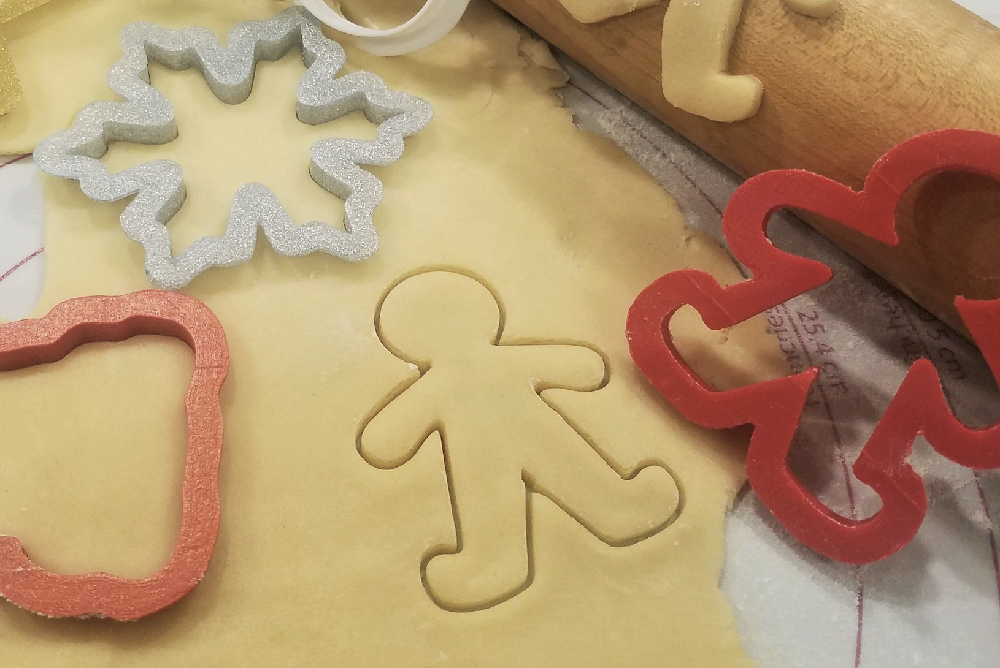

## I smell cookies and creativity!

I am a big fan of cookies, whether it be shortbread, sandwich cookies, or drop cookies. I usually use cookie cutters to create my cookies and sometimes when I feel a little bit of creativity in me, I combine various cookie cutters to create interesting shapes. Like three circles stacked upon each other for a snowman. Ultimately, even though there are various ways, the end goal is the same: to produce delicious, fresh cookies!

## Cutters and Patterns

Design patterns are quite similar. They are the cookie cutters that you can customize in order to solve a design problem in your code. You know what the end result and features are but how you implement it is totally up to you. The pattern is a general concept for solving a particular problem similar to how the cookie cutter is a way to solve the problem of creating cookies in a uniform manner. 

## Design patterns ≠ Styling

The first time I encountered the word “design patterns” I thought it was referring to more about the overall user experience and interaction like how the colors were uniformed across all the pages. I never noticed how design patterns were used in my program until learning more about it. In one of the projects that I worked on with a team, I used the Model View Controller design pattern which essentially separated the model from the view with the controller handling all the events. My model was in MongoDB and the view was written mostly in Javascript and React. One design pattern that I thought was pretty cool was the Mediator design pattern which allows you to reduce chaotic dependencies between objects by using a mediator object which restricts the communication between various objects. The mediator object is kind of like an air traffic controller who communicates with the pilot on the aircraft for safety and efficiency within the vicinity of the airport and not during the entire flight. I hope to learn more about design patterns in my future classes too!

