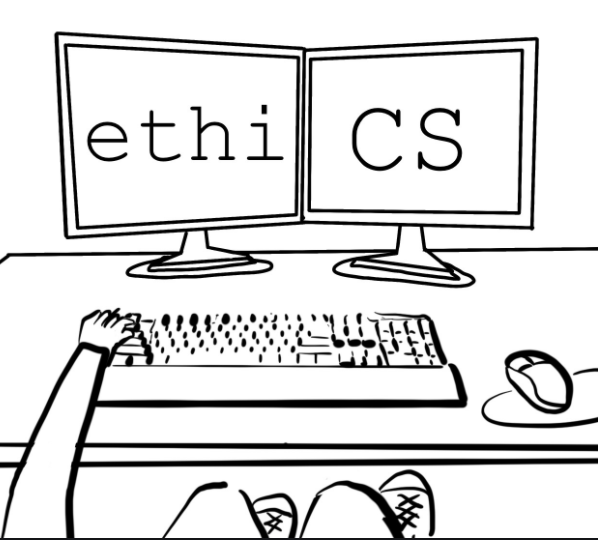

Before I began ICS 314: Software engineering, I thought that computer science meant the same thing as software engineering. However, as I progressed through the class, I like to say that I learned a different aspect of computer science where the focus was less on theory but more on the practical application of computer science. I am sure that the concepts that I learned in this class will be useful for internships and jobs. Moreover, we often think that computer science is just coding but in reality, there are many concepts beyond the hard skills like knowing different programming languages. 

## Open Source Development

In the class, we used a lot of open source technologies like Bootstrap, MongoDB, React, Meteor. In the future, I hope to be able to contribute to open source projects starting from the very basics like improving documentation. Open source can lead to faster development and innovation to create systems that are more reliable and advanced since developers can find and fix bugs more rapidly. Moreover, open source can lead to new technologies and applications. For instance, Meta recently released LLaMA (Large Language Model Meta AI) which is a large language model to help accelerate the work being done in this field of natural language processing. This helps further democratize access to the technology and allow people around the world to explore potential applications of the model, capabilities and limitations of the model, and developing new techniques to mitigate biases and harmful content generations. 

## Ethics in Software Engineering

Ethics in software engineering is also another important topic. This topic often refers to ethical issues in the use and design of technology especially as software engineers, our actions can change the world. I think this aspect of ethics also influences the industry that I would want to work in because how the product that I am working on can influence people is also an important factor. This topic is key to me because I am interested in working in the intersection of healthcare and technology and work done in this field can significantly affect people and society. As a computing professional, it is of essence to respect privacy, confidentiality and contribute to the society and human-well being. 
