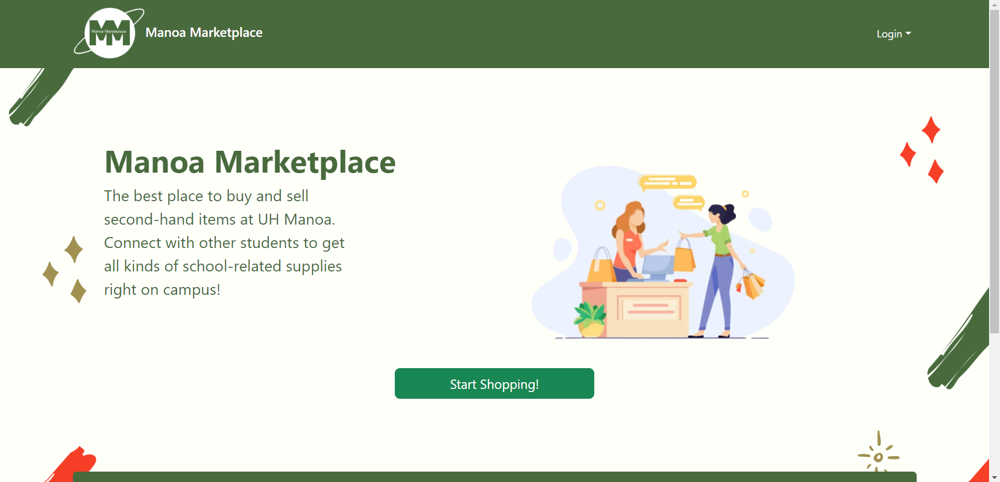

Manoa Marketplace is a team project for ICS 314: Software Engineering where we created a web application that provides a safe and simple method for students and faculty to buy and sell items on campus. Main technologies that were used include React, JavaScript, Bootstrap, CSS, Meteor.js. This project used a issue driven development system. I learned a lot about working in a team because I often work on individual assignments in my computer science courses and this was the first team project that I worked on. I also learned a lot about GitHub and how it works, especially in a team environment. I also realize how important communication is so that everybody is on the same page and understands what your thoughts are.

My contributions to the project include: 
* Creation of MongoDB collections
* Overall website user interface design
* Add Listings page
* Admin All Listings page
* Admin reported users/listings page
* Testing for all pages

  
  

This is a picture of our landing page, which I designed.

Visit our [GitHub page](https://manoamarketplace.github.io/) to check out our project!
