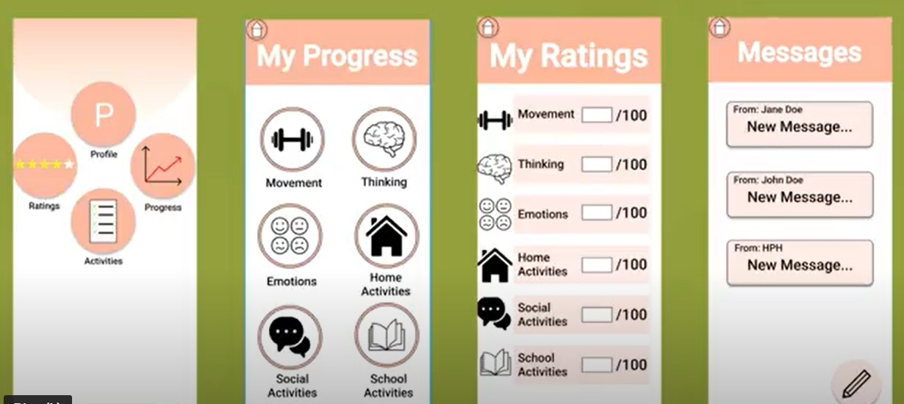

Medical Innovation and Design Hawaii is a program where students and faculty from various fields ranging from business, medicine, engineering come together to solve challenging medical problems. 

For this project, we collaborated with the Kapiolani Medical Center for Women and Children Concussion Clinic to design a mobile application that allowed patients and healthcare providers to communicate outside of regular appointment times. The main goal was to create an engaging platform to improve collaboration in rehabilitative care. Self-reflection criterias were also incorporated to encourage patients to reflect on their progress in care. Exercises were assigned based on the individual's condition and patients were encouraged to do these activities and self-reflection between their visits. Appointments continued to take place at the hospital clinic as this mobile application was meant to be a supplemental solution. 

See below for our app prototype.

  
  

