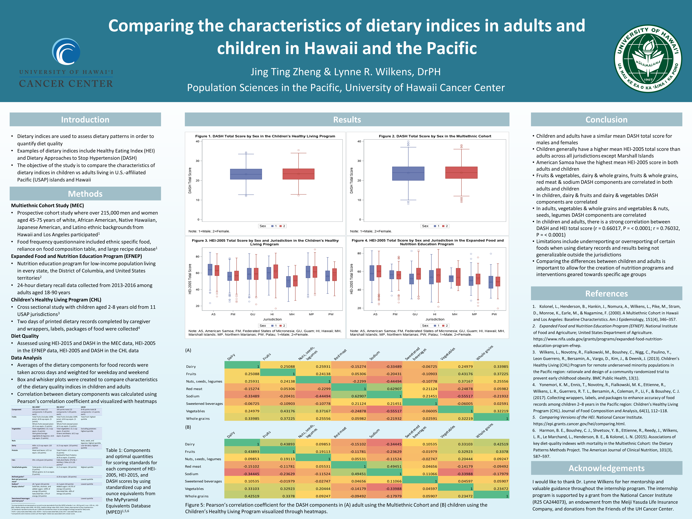

I conducted research at the University of Hawaii Cancer Center under Dr. Lynne Wilkens. I worked independently on a research project where I compared the dietary indices between adults and children living in the Pacific. I used multiple large datasets involving over 100,000 participant data. The datasets I specifically used were the Multiethnic Cohort Study, Expanded Food and Nutrition Education Program (EFNEP), and Children's Healthy Living Program. I  performed statistical analysis, data wrangling, and data visualization using SAS and communicated my findings through a poster presentation to faculty researchers and the community. 

I actively participated in seminar talks and journals clubs held by the faculty researchers at the University of Hawaii Cancer Center and John A. Burns School of Medicine. These research ideas sparked my interest in the intersection of software, systems, and society and the overall implications of these revolutionary software advances in the world.

You can find my final poster below.

  
  

