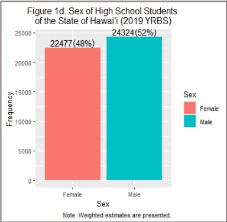

At the Pacific Health Analytics Collaborative, as a research assistant, I analyzed national 2019 Youth Risk Behavior Surveillance System (YRBSS) data from the Centers for Disease and Control using the programming language R. We specifically focused on youth that were aged 12-18 residing in the State of Hawaii. Using the data, I conducted a study regarding the association between substance use, specifically tobacco use, and bullying among youth in Hawaii. I collaborated with epidemiologists, data scientists, and public health researchers on this study. The data was further analyzed using statistical computing like chi-square test, multiple logistic regression, and odds ratio. My insights were communicated using data visualization packages like ggplot2 in R. 

I also conducted a thorough scientific literature review and learned how to conduct reproducible, replicable, and ethical research. I also attended seminars and professional development workshops with speakers from HMSA, Hawaii Department of Health, the Queen’s Medical Center, and the University of Hawaii. Through this project, I was able to solidify my research skills and gained a greater understanding of how to communicate to my peers, community, and professionals. I learned more about statistics and best practices to developing a study design. 

Here is one of our data visualizations. 

  
  

